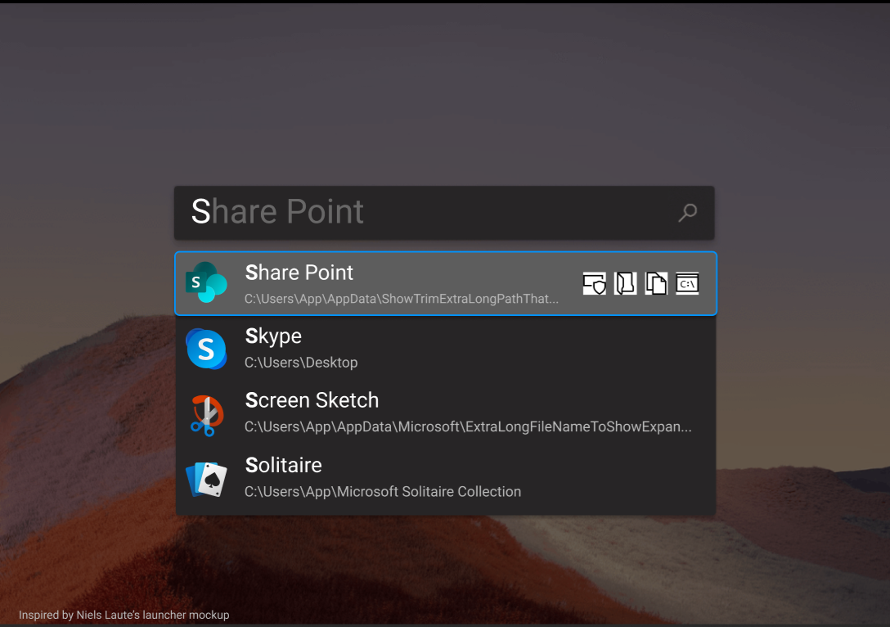
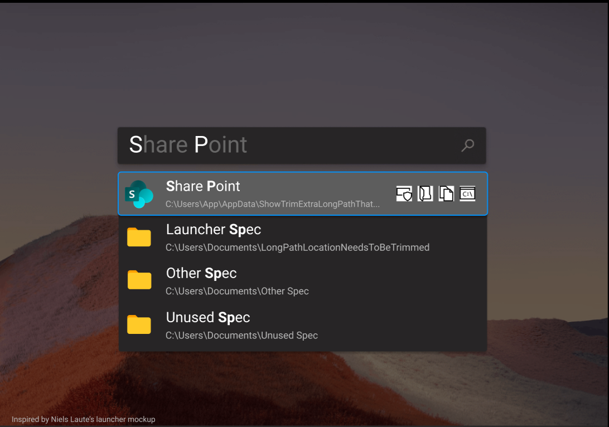
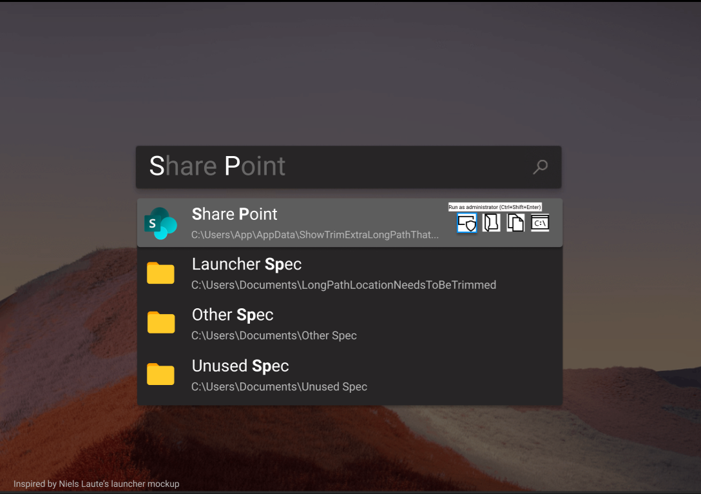
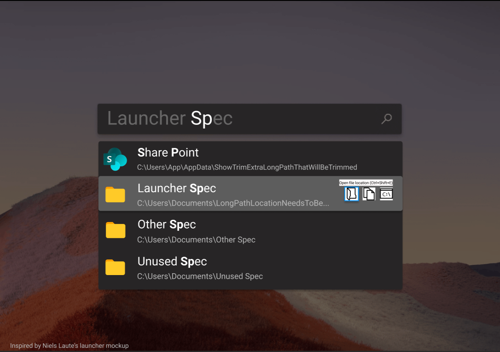
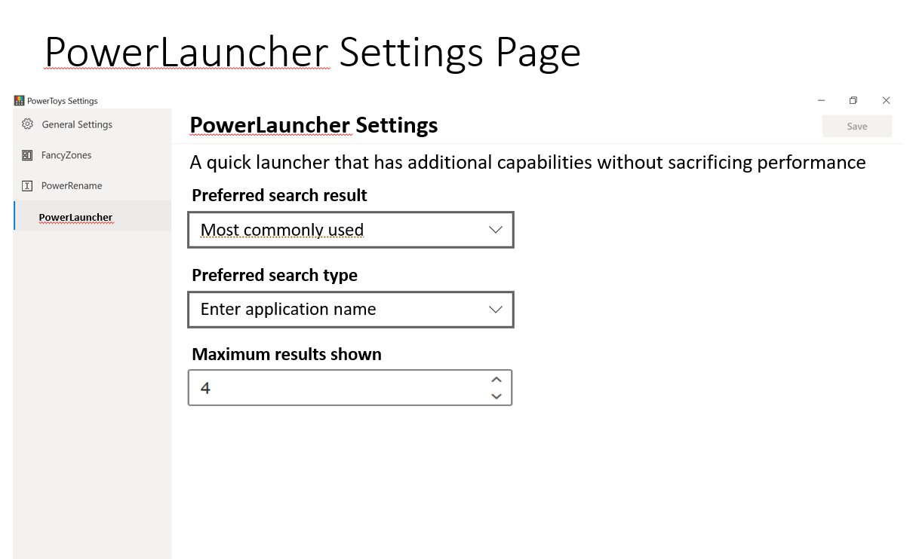

# Launcher Spec

  - **What is it:** Quick launcher for power users which has additional capabilities
    without sacrificing performance
  - **Author:** Jessica Yuwono
  - **Spec Status:** Review

# 1\. Overview

| **Terminology** | **Definition**                                                                              |
| --------------- | ------------------------------------------------------------------------------------------- |
| Context menu    | The menu which opens when a user performs right-click/<kbd>Shift</kbd>+<kbd>F10</kbd> on a selected search result |
| Text suggestion | Text which appears on the search box when users type           |
| App suggestion  | List of applications that may be relevant on the search result based on the typed string    |

## 1.1. Elevator Pitch / Narrative

Jane is a Windows power user who uses Run prompt to launch her
applications. She types in the executable name of an application using Run prompt for most cases. However, there are times when she doesn’t know the executable name. She needs to launch the application using Search but Run is faster than Search and Search doesn't always provide relevant results to her. Switching between Run and Search also slows down her workflow.

She learns about PowerToys and installed PowerToys on her machine. Once
Jane downloads it, PowerLauncher is included in PowerToys. She can now
search for an application and launch an application instantly with
PowerLauncher. She can also personalize her launcher to cater to her
needs by putting search based on executable names on top of the result
and show her the most recently used application. She can also add
plugins which gives her additional features that she needs in a launcher, like calculator or
dictionary. After using PowerLauncher, she feels more productive since it is fast, customizable, and it gets the result
that she wants.

### 1.1.1 Short Version

It’s fast… It’s customizable… It’s PowerLauncher, a new toy in PowerToys
that can help you search and launch your app instantly\! It is open
source and modular for additional plugins.

## 1.2. Customers

PowerToys is mainly targeted towards Windows power users though it is
available to users who want to experience using Windows in a more
efficient and productive way.

## 1.3. Problem Statement and Supporting Customer Insights

Through [GitHub
issues](https://github.com/microsoft/PowerToys/issues/44) in PowerToys
repository, Windows users expressed the need for a fast and reliable
launcher with additional capabilities, such as text suggestion as users
type, auto-completion on tab, and options to do more actions like run in
administrator mode or open in PowerShell. This issue received the fourth most thumbs up (with
70+ thumbs up) in the category of suggested PowerToy indicating that
users are interested in this PowerToy.

### 1.3.1 Survey Results

PowerToys team sent a survey to Windows Developer community to gain preliminary insights on users’ current launch experience. Here are some key takeaways:

1.  Nearly 70% of respondents want “run as administrator” to be a
    feature in an application launcher. The next most requested feature
    is auto-complete text suggestions.

2.  Less than 15% of respondents who use Windows as their main OS use
    third-party tools as a part of their launch experience.

3.  Nearly 65% of respondents enters an application name when searching.

4.  All respondents who use MacOS as their main OS and use third-party tools to launch an
    application runs Alfred.

5.  For respondents who launch applications using Search on Windows, performance and accuracy
    of search result are two top most requested improvements that
    they would like to see.

## 1.4. Existing Solutions or Expectations

Currently, power users can launch an application using Windows launcher by
running <kbd>Win</kbd>+<kbd>R</kbd> shortcut or searching the desired application in Windows
Search (<kbd>Win</kbd>+<kbd>S</kbd>, Windows menu + start typing). Power users can also search
for results through Windows Search by typing in the search bar directly
or by specifying a category (apps, documents, email, web, folders,
music, people, photos, settings, and videos). Several third-party tools
also exist to extend the capability of Windows’ launcher.

Here is a matrix which compares features between third-party tools:

| Tools/Features     | Text suggestion    | App suggestion     | Open in terminal  | Run as admin       | Saved history from previous session | Open file location |
|--------------------|--------------------|--------------------|-------------------|--------------------|-------------------------------------|--------------------|
|[Alfred (free)](https://www.alfredapp.com/)       | ![alt text][cross] | ![alt text][check] |![alt text][cross] | ![alt text][cross] | ![alt text][check]                  | ![alt text][cross] |
|[Spotlight](https://support.apple.com/en-us/HT204014)
       | ![alt text][check] | ![alt text][check] |![alt text][cross] | ![alt text][cross] | ![alt text][check]                  | ![alt text][check] |
|[Listary](https://www.listary.com/)
         | ![alt text][cross] | ![alt text][check] |![alt text][cross] | ![alt text][check] shown as a separate cmd | ![alt text][cross]                  | ![alt text][check] on right click |
|[Wox](http://www.wox.one/)
             | ![alt text][cross] | ![alt text][check] |![alt text][check] via <kbd>></kbd> or <kbd>Win</kbd>+<kbd>R</kbd> | ![alt text][check] on right click/ <kbd>Shift</kbd>+<kbd>Enter</kbd> | ![alt text][check]                  | ![alt text][check] on right click/ <kbd>Shift</kbd>+<kbd>Enter</kbd>|
|[Launchy](https://www.launchy.net/index.php)
         | ![alt text][cross] | ![alt text][check] |![alt text][cross] | ![alt text][cross] | ![alt text][cross]                  | ![alt text][cross] |
|[Rofi](https://github.com/davatorium/rofi)
            | ![alt text][cross] | ![alt text][check] | N/A | N/A | ![alt text][check]                  | ![alt text][cross] |
|[Executor](http://www.executor.dk/)
        | ![alt text][check] | ![alt text][check] |![alt text][cross] | ![alt text][check]<kbd>Shift</kbd>+<kbd>Enter</kbd> | ![alt text][check]                  | ![alt text][check] on right click |
|[Ueli](https://github.com/oliverschwendener/ueli)
             | ![alt text][cross] | ![alt text][check] |![alt text][check] via <kbd>></kbd>| ![alt text][check] <kbd>Ctrl</kbd>+<kbd>Shift</kbd>+<kbd>Enter</kbd> | ![alt text][check] configurable in settings | ![alt text][check] on file/folder type |
|Run (<kbd>Win</kbd>+<kbd>R</kbd>)
     | ![alt text][cross] | ![alt text][cross] |![alt text][check] | ![alt text][check] <kbd>Ctrl</kbd>+<kbd>Shift</kbd>+<kbd>Enter</kbd> | ![alt text][check]                  | ![alt text][cross] |
|Search (<kbd>Win</kbd>+<kbd>S</kbd>)
  | ![alt text][check] | ![alt text][check] |![alt text][check] | ![alt text][check] on right click/preview | ![alt text][cross]                  | ![alt text][check] on right click/preview |

Here are some screenshots on Spotlight and some of the most commonly used third-party
launchers:

1.  Spotlight

2.  Wox

3.  Launchy

4.  Alfred

## 1.5. Goals/Non-Goals

### 1.5.1 Goals

**a. User Experience**

  - > PowerLauncher is a fast launcher with additional capabilities that
    > users need

  - > PowerLauncher is available for Windows 10

  - > PowerLauncher should be faster than start menu/<kbd>Win</kbd>+<kbd>S</kbd> for showing
    > search result and launching applications

**b. Settings**

  - > PowerLauncher UI for settings should be integrated with other
    > PowerToys settings

**c. Keyboard Shortcut**

  - > PowerLauncher default keyboard shortcuts should not conflict with
    > other PowerToys’ keyboard shortcuts

  - > PowerLauncher’s default keyboard shortcuts are customizable by
    > users

### 1.5.2 Non-Goals

**a. User Experience**

  - > Support Windows version earlier than Windows build 17134 [April 2018 Update](https://support.microsoft.com/en-us/help/4516058/windows-10-update-kb4516058)

**b. Settings**

  - > Only disabling PowerLauncher telemetry. Users will be able to turn off
    > telemetry settings for PowerLauncher as a whole.

  - > Users should be able to share settings across machines

**c. Keyboard Shortcut**

  - > Migrating keyboard shortcut settings to Keyboard Shortcut Manager
    > PowerToy

# 2\. Requirements

## 2.1. Functional Requirements

### 2.1.1 User Experience

| **No** | **Requirement**                                                                                                                                          | **Priority** | **Status/Issue #** |
| ------ | -------------------------------------------------------------------------------------------------------------------------------------------------------- | ------------ | ----|
| 1      | Users can navigate through PowerLauncher by using their keyboard                                                                                         | 1            | Done |
| 2      | Users can see their previously typed text on PowerLauncher                                                                                               | 1            | Done |
| 3      | PowerLauncher should use fuzzy search to provide search results based on any typed character                                                                                                                   | 1            | [#3624](https://github.com/microsoft/PowerToys/issues/3624) |
| 4      | PowerLauncher should appear in the center of the screen                                                                                                                    | 1            | Done |
| 5      | Users can directly call command like they would via Run prompt                                                                                           | 1            | [#4143](https://github.com/microsoft/PowerToys/issues/4143), [#3251](https://github.com/microsoft/PowerToys/issues/3251), [#3206](https://github.com/microsoft/PowerToys/issues/3206) |
| 6      | PowerLauncher should meet [accessibility requirements](https://docs.microsoft.com/en-us/style-guide/accessibility/accessibility-guidelines-requirements) | 1            | [#3445](https://github.com/microsoft/PowerToys/issues/3445), [#3483](https://github.com/microsoft/PowerToys/issues/3483), [#2993](https://github.com/microsoft/PowerToys/issues/2993) |
| 7      | PowerLauncher should respect light, dark, and high-contrast mode                                                                                         | 1            | Done ([#3485](https://github.com/microsoft/PowerToys/issues/3485)) |
| 8      | PowerLauncher should meet [localization](https://docs.microsoft.com/en-us/dotnet/standard/globalization-localization/localization) requirements          | 1            | [#4146](https://github.com/microsoft/PowerToys/issues/4146), [#3367](https://github.com/microsoft/PowerToys/issues/3367), [#3659](https://github.com/microsoft/PowerToys/issues/3659), [#3773](https://github.com/microsoft/PowerToys/issues/3773), [#2175](https://github.com/microsoft/PowerToys/issues/2175), [#3538](https://github.com/microsoft/PowerToys/issues/3538), [#4147](https://github.com/microsoft/PowerToys/issues/4147) |
| 9      | Users should be notified if they have indexer turned off                                                                                                 | 1            | Done |
| 10      | Users will get text suggestion as they type in the launcher                                                                                              | 1            | Done |
| 11     | Users can see the name of the application/file/folder on the search result                                                                               | 1            | Done |
| 12     | Users can see path location of each search result                                                                                                        | 1            | [#3218](https://github.com/microsoft/PowerToys/issues/3218) |
| 13     | If name or location path is too long to display, the path location should be trimmed                                       | 1            | Done for name, [#3218](https://github.com/microsoft/PowerToys/issues/3218) |
| 14     | If name or location path is trimmed, users can hover on the name or location path and see the full text                                                              | 1            | Done |
| 15     | Users can see the icon of the application/file/folder next to the application/file/folder name                                                           | 1            | Done |
| 16     | Users can see the executable type (App/File Folder/Documents) of each search result                                                                      | 1            | Done |
| 17     |  Users can see buttons to run as administrator, open file location, copy path location, and open in console when the search result is in focus                                              | 1            | Done |
| 18     |  Users can see a tooltip describing actions to run as administrator, open file location, copy path location, and open in console when the buttons are hovered or are in focus                     | 1            | Done |
| 19     |  Users can see the keyboard shortcut to run as administrator, open file location, copy path location, and open in console when the buttons are hovered or are in focus                                     | 1            | Done |
| 20     |  Users can navigate through PowerLauncher by using up, down arrow ~~left, and right arrow~~ , and <kbd>Tab</kbd> from their keyboard                      | 1            | Done |
| 21     | Pressing up and down arrow on the keyboard will switch between previous and next search result                                              | 1            | Done |
| 22     | Pressing ~~right and left arrow~~ <kbd>Tab</kbd> on the keyboard will switch focus between the buttons on the focused search result                                             | 1            | Done |
| 23     |  The first search result should be in focus automatically when users are typing in the search box                                              | 1            | Done |
| 24     | For multiple monitors, the interface should follow where the mouse cursor is located                                                                     | 1            | Done |
| 25     | Users can navigate and open currently running applications/processes with at least one opened window                                                     | 2            | Done |
| 26     | Users can pin selected application/file/folder at the top of the search result which ties to the search term they input in the search box                | 2            | [#3839](https://github.com/microsoft/PowerToys/issues/3839) |
| 27     | Users can use keyboard shortcuts to open the search result                | 2            | [#4285](https://github.com/microsoft/PowerToys/issues/4285) |
| 28     | When using multiple keyboard layouts, users can type using any keyboard to get search result ~~which will map to the pressed keys~~ | 2            | [#3773](https://github.com/microsoft/PowerToys/issues/3773)
| 29     | Users can search based on specified category | 2            | [#3347](https://github.com/microsoft/PowerToys/issues/3347) |
| 30     | Users can install their own plugin to add additional capability to PowerLauncher                                                                         | 3            | [#3200](https://github.com/microsoft/PowerToys/issues/3200) |
| 31     | Users should be able to use PowerLauncher as a calculator                                                                                                | 3            | Done, improvements: [#2265](https://github.com/microsoft/PowerToys/issues/2265) |
| 32     | If user selects enter on a result of calculator, PowerLauncher should copy the result to clipboard                                                       | 3            | Done |
| 33     | PowerLauncher should respect users’ default browser setting for web searches                                                                             | 3            | [#3245](https://github.com/microsoft/PowerToys/issues/3245) |
| 34     | Users can search websites                                                                                                                                | 3            | [#3245](https://github.com/microsoft/PowerToys/issues/3245)
| 35     | Users should be able to use PowerLauncher as a dictionary                                                                                                | 3            | [#3309](https://github.com/microsoft/PowerToys/issues/3309)
| ~~36~~ | ~~Users should be able to see clipboard history~~                                                                                                            | ~~3~~            |
| ~~37~~     | ~~Users should be able to see options in the context menu which are similar to explorer~~                                                                                                            | ~~3~~            |
| 38     | Users can see preview of selected search result                                                                                                            | 3            | [#3310](https://github.com/microsoft/PowerToys/issues/3310) |

### 2.1.2 Settings

| **No** | **Requirement**                                                               | **Priority** | **Status/Issue #** |
| ------ | ----------------------------------------------------------------------------- | ------------ |----------------|
| 1      | Users can set their own preference on search result                           | 1            | [#3371](https://github.com/microsoft/PowerToys/issues/3371)
| ~~2~~      | ~~Users can set their own preference on preferred search type~~                   | ~~1~~            |
| 3      | Users can set the number of results shown on the menu                         | 1            | Done |
| 4      | Users can modify default keyboard shortcut to open PowerLauncher              | 1            | Done |
| ~~5~~      | ~~Users can modify default keyboard shortcut to open right-click context menu~~   | ~~1~~            |
| ~~6~~      | ~~Users can modify default keyboard shortcut to open file location~~            | ~~1~~            |
| ~~7~~      | ~~Users can modify default keyboard shortcut to copy path location~~ | ~~1~~            |
| ~~8~~      | ~~Users can modify default keyboard shortcut to open in console~~            | ~~1~~            |
| 9      | Users can set customize text size and text font                               | 2            | [#3539](https://github.com/microsoft/PowerToys/issues/3539) |
| 10     | Users can change the theme of PowerLauncher                                   | 3            | [#4034](https://github.com/microsoft/PowerToys/issues/4034) |
| 11     | Users can see third-party terminals in the dropdown list for default terminal | 3            | [#4283](https://github.com/microsoft/PowerToys/issues/4283) |
| 12     | Users can customize icon size in the search result | 3            | [#3503](https://github.com/microsoft/PowerToys/issues/3503) |

PowerLauncher will have a settings UI to allow users to set their
preference as follows:

1.  \[Dropdown\] Set search result preference
    
    1.  Most commonly used (default)
    
    2.  Most recently used
    
    3.  Alphabetical order
    
    4.  Running processes/opened applications

~~2.  \[Dropdown\] Preferred search type~~

   ~~1.  Application name (default)~~

   ~~2.  A string that is contained in the application~~

   ~~3.  Executable name~~

3.  \[Number\] Maximum results shown. Default to 4.

4.  Modify default keyboard shortcuts
    
    1.  \[Hotkey editor box\] Open PowerLauncher
    
    ~~2.  \[Hotkey editor box\] Open right-click context menu~~
    
    ~~3.  \[Hotkey editor box\] Open file location~~

    ~~4. \[Hotkey editor box\] Copy path location~~

    ~~5. \[Hotkey editor box\] Open in console~~

5.  \[Boolean\] Override Win+R key. Default to yes.

6.  \[Boolean\] Override Win+S key. Default to no.

In PowerToys General Settings:

1.  \[Dropdown\] Default shell. 

2.  \[Dropdown\] Default terminal.

### 2.1.3 Keyboard Shortcuts

| **No** | **Requirement**                                                                                     | **Priority** | **Status/Issue #** |
| ------ | --------------------------------------------------------------------------------------------------- | ------------ |-----|
| 1      | Users can choose to override <kbd>Win</kbd>+<kbd>R</kbd> or <kbd>Win</kbd>+<kbd>S</kbd> to launch PowerLauncher                       | 1            | Done ([#2325](https://github.com/microsoft/PowerToys/issues/2325)) |
| 2      | Users can run an application as administrator when executing <kbd>Ctrl</kbd>+<kbd>Shift</kbd>+<kbd>Enter</kbd> | 1 | Done |
| 3      | Users can copy path location when executing <kbd>Ctrl</kbd>+<kbd>C</kbd>                            | 1            | Done |
| 4      | Users can open file location when executing <kbd>Ctrl</kbd>+<kbd>Shift</kbd>+<kbd>E</kbd>                            | 1            | Done |
| 5      | Users can open selected result in console when executing <kbd>Ctrl</kbd>+<kbd>Shift</kbd>+<kbd>C</kbd>                            | 1            | Done |
| 6      | PowerLauncher should open when <kbd>Alt</kbd>+<kbd>Space</kbd> is executed                                                | 1            | Done |
| 7      | Users can close PowerLauncher by pressing <kbd>Esc</kbd> ~~if the search box is empty~~ | 1            | Done |
| ~~8~~      | ~~Users can auto-complete text suggestions (per words) by pressing <kbd>Tab</kbd>~~                                | ~~1~~            |
| 8      | Users can navigate through search result and context menu buttons by pressing <kbd>Tab</kbd> | 1            | Done |
| 9      | Any changes in the keyboard shortcut in PowerLauncher should be reflected in Windows Shortcut Guide | 1            | [#4284](https://github.com/microsoft/PowerToys/issues/4284) |
| 10      | Users can use <kbd>Ctrl</kbd>+\<insert number> to launch from the search result | 2            | [#4285](https://github.com/microsoft/PowerToys/issues/4285) |
| 11      | Users can add custom aliases which tie to a specific application                                    | 3            | [#3363](https://github.com/microsoft/PowerToys/issues/3363) |

## 2.2 Measure Requirements

| **No** | **Requirement**                                                                                          | **Reason**                                                                           | **Priority** |
| ------ | -------------------------------------------------------------------------------------------------------- | ------------------------------------------------------------------------------------ | ------------ |
| 1      | Load time when launching the application                                                                 | Make sure PowerLauncher meets performance requirement                                            | 1            |
| 2      | Average load time when a character is typed in the search box and the search result is updated           | Make sure PowerLauncher meets performance requirement                                            | 1            |
| 3      | Number of times a user deletes typed text after launching the application                                | Make sure PowerLauncher is not missing any keystrokes on initial launch              | 1            |
| 4      | Number of users who disabled PowerLauncher                                                               | Identify whether PowerLauncher is being used by users                                | 1            |
| 5      | Average number of times PowerLauncher is displayed on the screen in 24 hours                             | Identify how many times does a user use PowerLauncher                                | 1            |
| 6      | Average number of times a button in the search result is selected in 24 hours   | Understand what is the most and least used option to help drive priority for enhancements and fixes  | 1            |
| 7      | Average number of times a button in the search result is executed through keyboard shortcuts in 24 hours                                         | Understand and compare usage of keyboard shortcuts versus mouse click             | 1            |

## 2.3 Public Name

The initially proposed name for this app is PowerLauncher.

# 3\. Storyboard and Mockups

## 3.1 State Flow Diagram
Every time PowerLauncher is launched, it will check whether there is a history (previously typed text and populated search result) present. If there is, PowerLauncher will pre-populate the text and search result, otherwise it will show an empty search box. Once users type a character in the search box, PowerLauncher will automatically populate search result based on the character. If users perform right-click/<kbd>Shift</kbd>+<kbd>F10</kbd> on a search result, they will see the context menu with various options. PowerLauncher will disappear from the view when users select on a search result.

## 3.2 Mockups
The following mockups only contain designs for requirements in priority 1.

# 4\. Dependencies

  - [WindowWalker](https://github.com/betsegaw/windowwalker)
    
      - PowerLauncher is planning to integrate with WindowWalker to add
        capability for searching running applications/processes

  - [WoX](http://www.wox.one/)
    
      - We may collaborate with WoX

  - [Keyboard Shortcut Manager PowerToy](https://github.com/microsoft/PowerToys/pull/1112)
    
      - PowerLauncher has functionality to modify keyboard shortcuts.
        This UI should eventually be integrated with keyboard shortcut
        manager toy to provide a coherent shortcut manager across all
        toys.

  - [Ability to set a default
    console](https://github.com/microsoft/terminal/issues/492)
    
      - Currently, there is no way to set the conhost.exe in order to
        set a console as default

# 5\. Supporting Documents

1.  [Difference between a console, a shell, and a
    terminal](https://www.hanselman.com/blog/WhatsTheDifferenceBetweenAConsoleATerminalAndAShell.aspx)

2.  [Search indexing in
    Windows 10](https://support.microsoft.com/en-us/help/4098843/windows-10-search-indexing-faq)

3.  [Collect known PowerShell installations for settings](https://github.com/microsoft/terminal/commit/bba0527af9853f984a30183c2d9d5bfca7469f09)

4. [Original launcher mockup by Niels Laute](https://github.com/microsoft/PowerToys/issues/44#issuecomment-585337044)

[cross]: ./images/PowerLauncher/cross.png
[check]: ./images/PowerLauncher/check.png